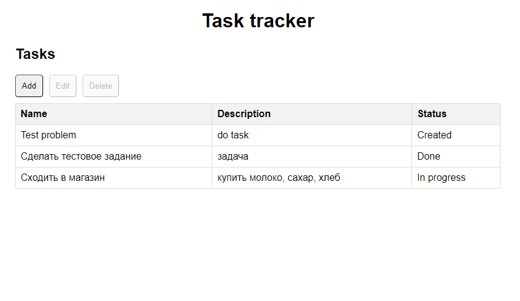
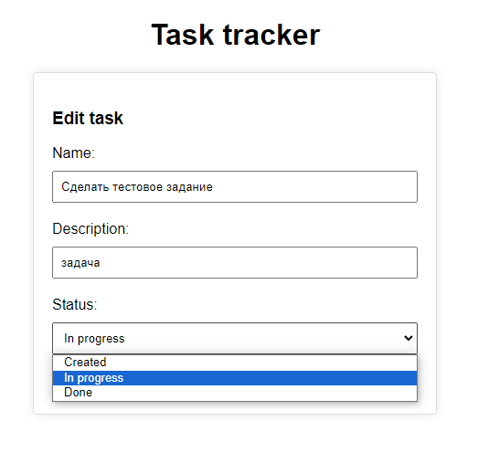
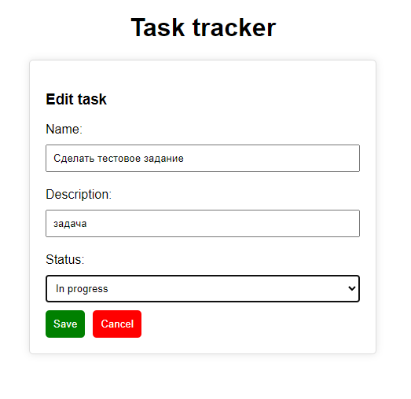

# Task manager тестовое задание
Веб-приложение для управления задачами. Есть возможность добавить задачу, введя название и описание задачи, редактировать информацию по задаче, назначить статус выполнения задачи (создана, в работе, выполнена), удалить задачу.

На серверной части используется язык C#, платформа .NET и фреймфорк ASP.NET Core.
 
На клиентской части используется React.

## База данных и ORM
Приложение использует базу данных SQLite для хранения информации о задачах. Для работы с базой данных используется ORM Entity Framework Core.

## Модель данных

### Задача

- Id задачи
- Наименование задачи
- Описание задачи
- Id статуса задачи

### Статус

- Id статуса
- Наименование статуса
 

Имеется три статуса задачи:
- id 1 - создана
- id 2 - в работе
- id 3 - завершена

## Эндпоинты API

Приложение предоставляет следующие конечные точки API для выполнения операций:

### Задачи 

- `GET /api/problems`: Получить список всех задач.
- `GET /api/problems/{id}`: Получить задачу по id.
- `POST /api/problems`: Создать задачу.
- `PUT /api/problems/{id}`: Обновить информацию о задаче по id.
- `DELETE /api/problems/{id}`: Удалить задачу по id.

### Статусы

- `GET /api/statuses`: Получить список всех статусов.
  
 

